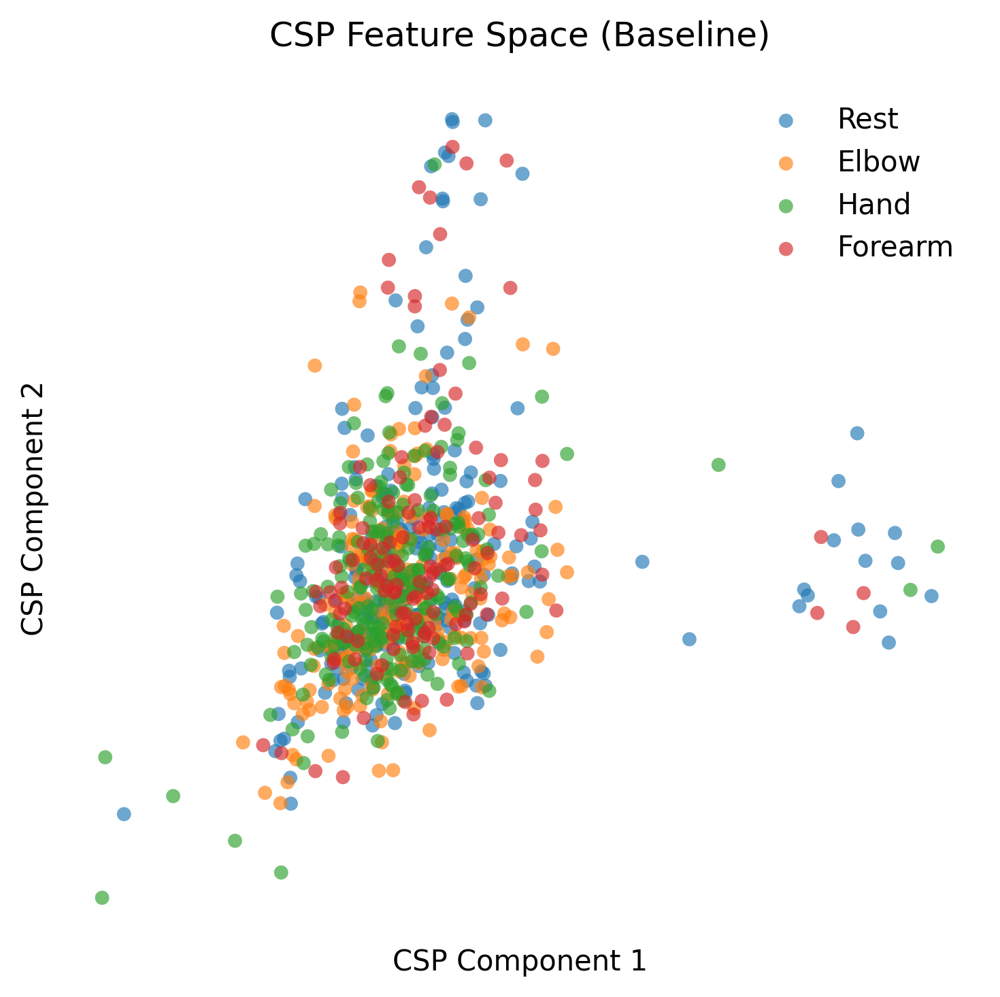
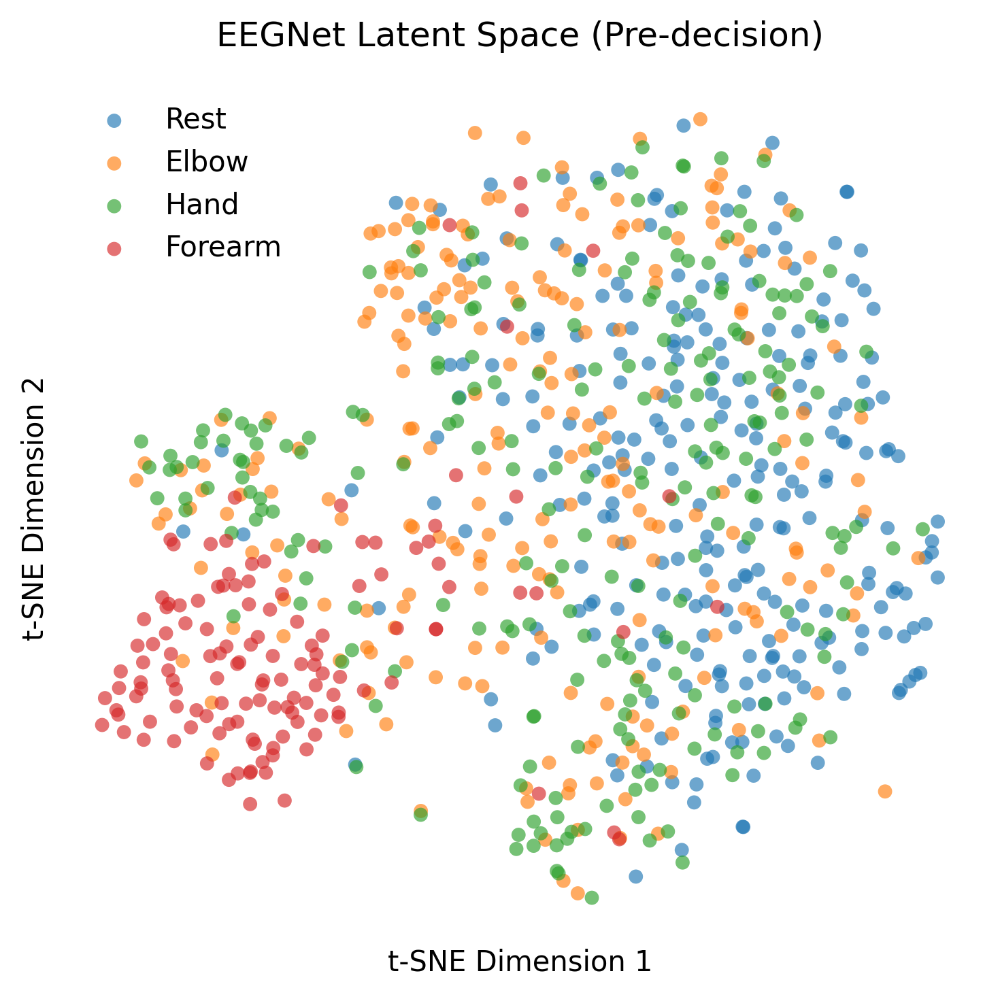
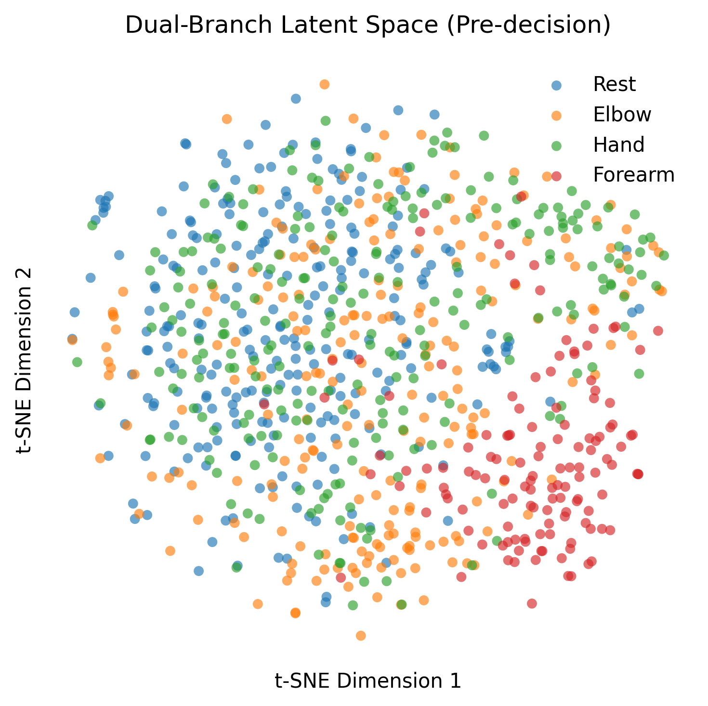
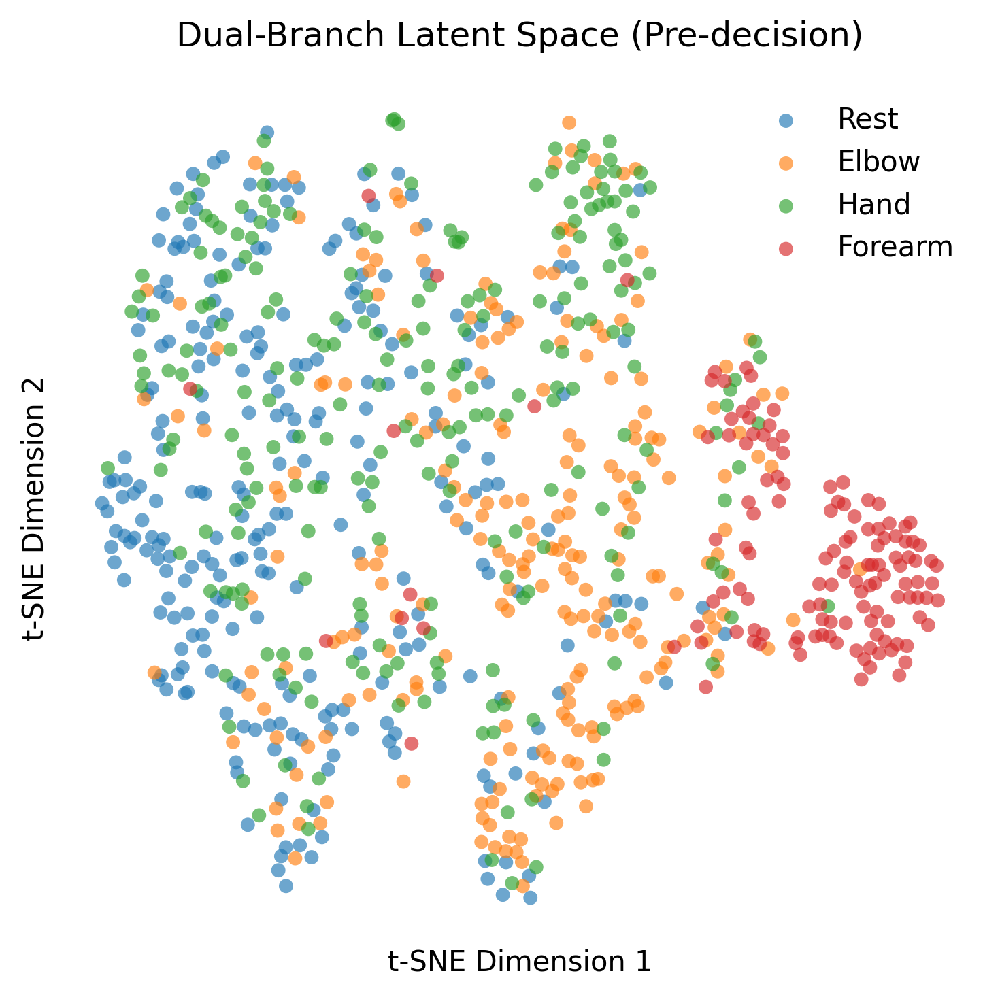
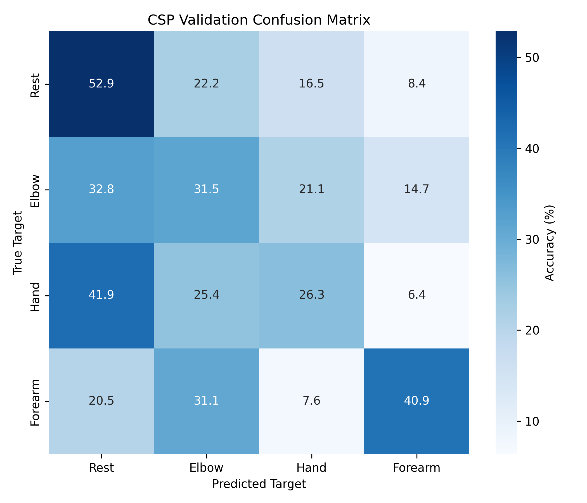
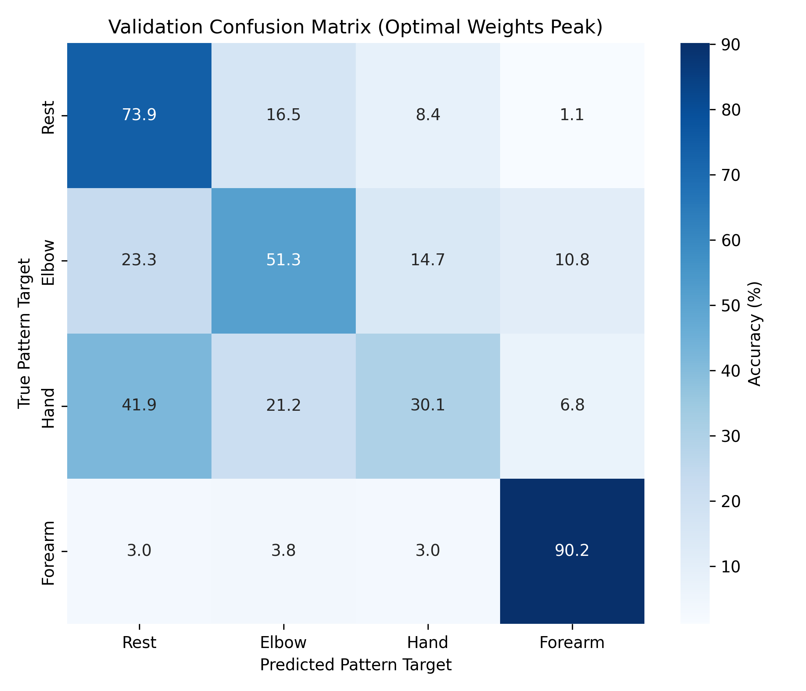
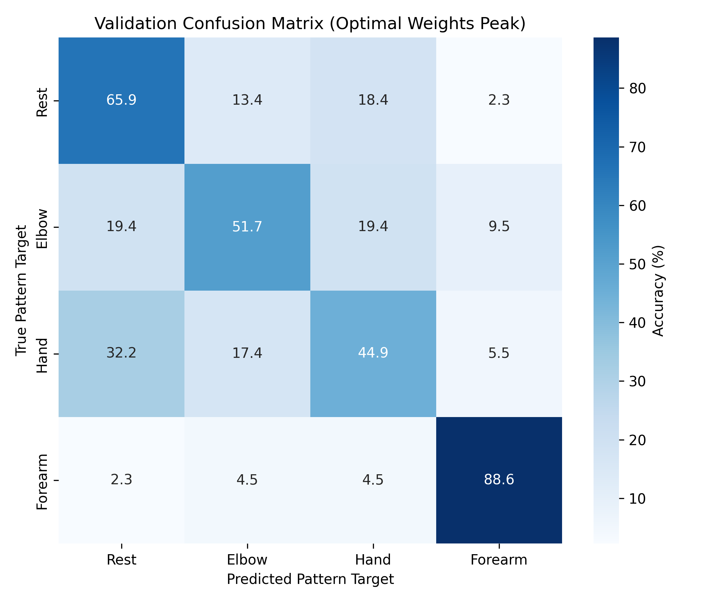

# EEG-Based Same-Limb Movement Classification

This project compares a classical EEG decoding pipeline (**CSP + LDA**) against deep learning approaches for classifying four upper-limb movement classes from EEG recordings: **elbow**, **hand**, **forearm**, and **rest**.

Using the Graz Movement Execution dataset, we investigate whether temporal, spectral, and connectivity-based representations can improve same-limb movement decoding, a task where traditional CSP methods struggle.


## Repository Structure

```text
├── data
│   ├── processed
│   │   ├── dataset_test.npz
│   │   └── dataset_train.npz
│   └── raw
│       ├── S1
│       │   ├── ME_S01_r01.mat
│       │   ├── ME_S01_r02.mat
|       ...
├── models
├── notebooks
├── requirements.txt
├── scripts
│   ├── build_dataset.py
│   ├── train_csp.py
│   ├── train_eegconn.py
│   ├── train_eegnet.py
│   ├── train_eegpsd.py
│   └── visualizer.py
└── src
    ├── config.py
    ├── load_data.py
    ├── networks.py
    ├── pipeline.py
    ├── processing.py
    └── utils.py
```

## Setup

Create and activate a virtual environment:

```bash
python -m venv .venv
source .venv/bin/activate
```

Install dependencies:

```bash
pip install -r requirements.txt
```

Download the Graz Movement Execution dataset and place the recordings under:

```text
data/raw/
```

Build the processed dataset:

```bash
python -m scripts.build_dataset
```

---

## Training

Classical baseline:

```bash
python -m scripts.train_csp
```

EEGNet baseline:

```bash
python -m scripts.train_eegnet
```

EEGNet + PSD fusion:

```bash
python -m scripts.train_eegpsd
```

EEGNet + Connectivity fusion:

```bash
python -m scripts.train_eegconn
```

---

## Results

The classical CSP + LDA pipeline performs poorly on same-limb movement classification, achieving approximately **36% accuracy**. Deep learning models learn richer temporal and multimodal representations, leading to substantially better performance.

| Model | Accuracy |
|---------|----------|
| CSP + LDA | ~36% |
| EEGNet | ~56% |
| EEGPsdNet | ~61% |
| EEGConnNet | ~61–62% |

### Latent Space Representations

The following t-SNE projections visualize the learned feature spaces before the final classifier. Deep learning models produce more separable clusters than the classical CSP baseline.

<p align="center">
  
  
  
  
</p>

### Confusion Matrices

Confusion matrices on the validation split. The multimodal models reduce class confusion compared to the temporal-only baseline.

<p align="center">
  
  
  
  
</p>

---
