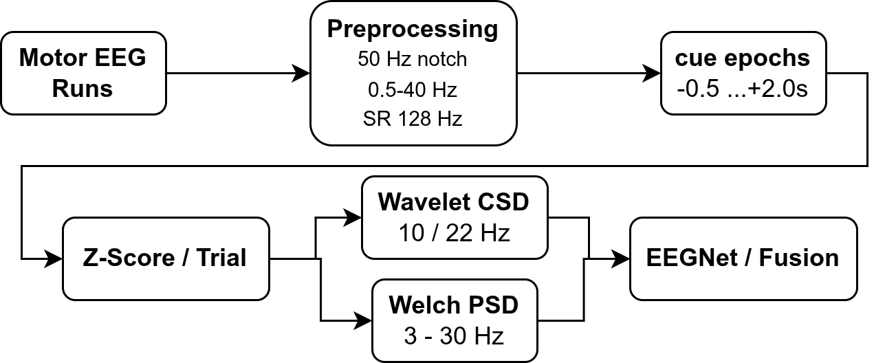
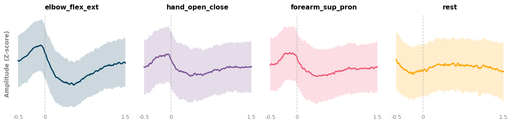
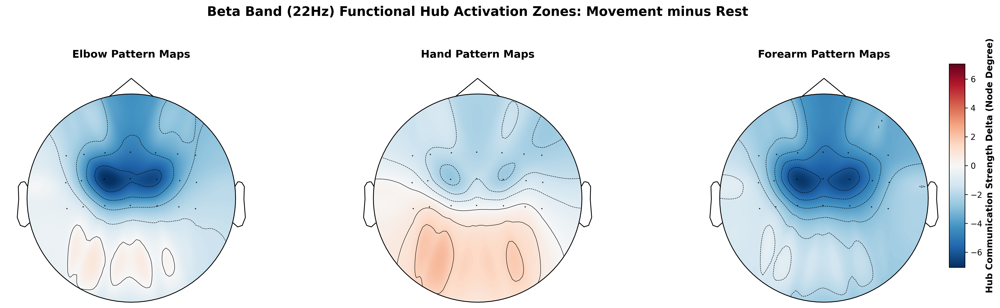
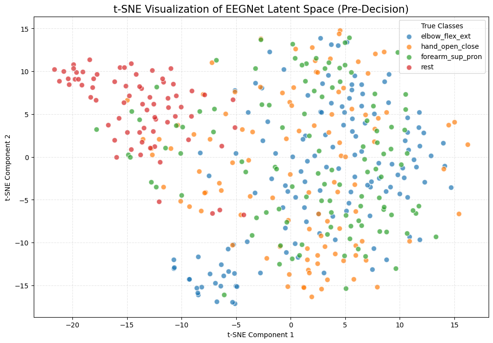
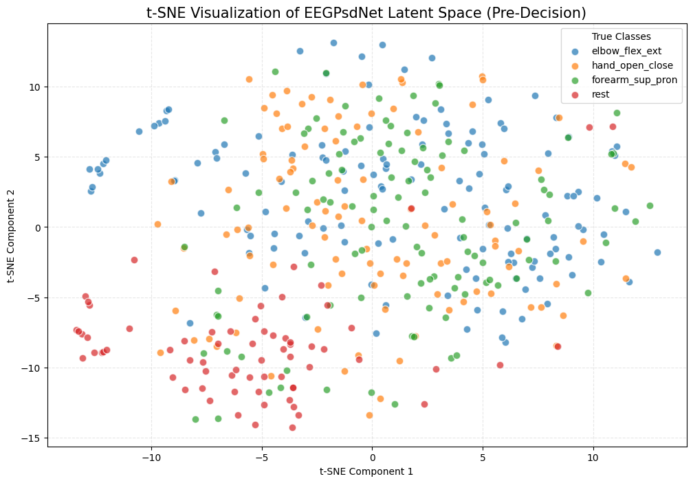
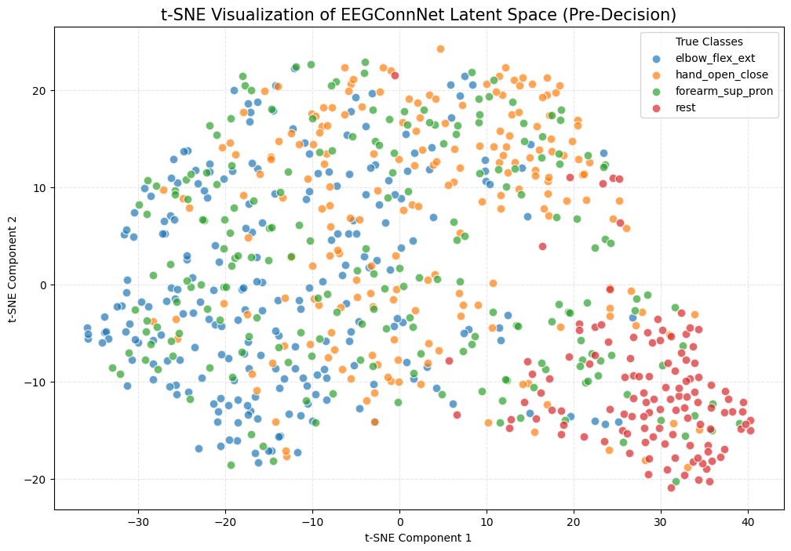
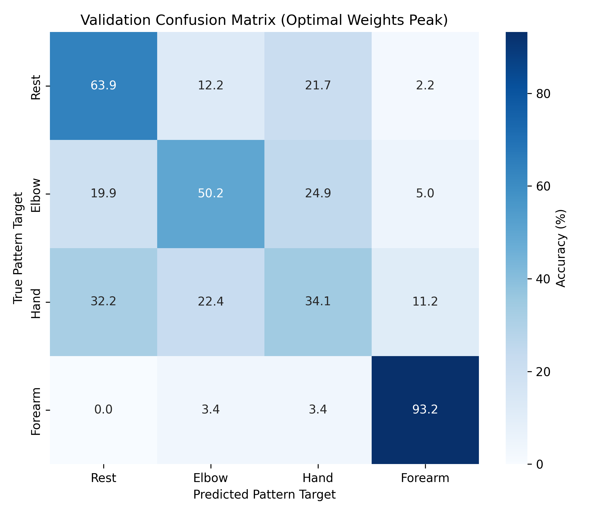
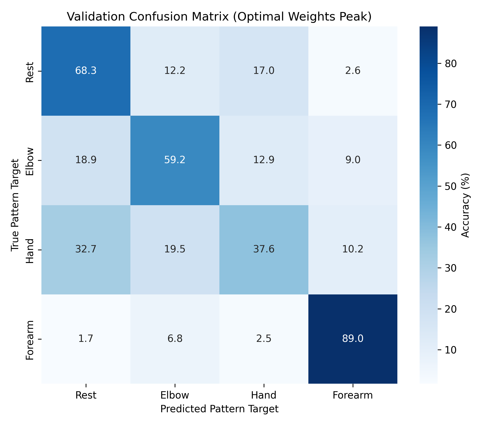
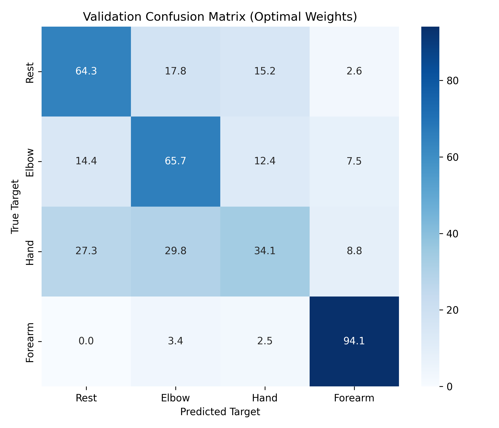

# Multi-modal EEG fusion for upper-limb motor decoding

Comparative study on **non-invasive EEG** for four-class **upper-limb motor intent** (elbow, hand, forearm, rest) using the Graz movement–execution corpus (BNCI Horizon 2020, [`001-2017`](https://bnci-horizon-2020.eu/database/data-sets)): classical **CSP + LDA** versus **deep convolutional decoders**, including **dual-branch models** that fuse **filtered, cue-locked EEG epochs**~(time-domain waveforms after the shared preprocessing pipeline) with **Welch PSD maps** and **wavelet cross-spectral connectivity** features.

Full write-up: compile `report/main.tex` (PDF) or open the generated manuscript. Figures below come from `report/img/` (same assets used in the paper).

---

## What this repository contains

| Block | Idea | Code entry points |
|--------|------|-------------------|
| **I — Classical** | Common Spatial Patterns + LDA on band-passed epochs | `scripts/train_csp.py`, hyperparameter search `scripts/tune_csp_preprocessing.py` |
| **II — Deep learning** | EEGNet-style CNN on filtered EEG epoch tensors | `scripts/train_eegnet.py` → `src/networks.py` (`EEGNet`) |
| **II — Spectral fusion** | Temporal branch~(filtered epochs) + shallow encoder on Welch PSD (`EEGPSDNet`) | `scripts/train_eegpsd.py` |
| **II — Connectivity fusion** | Temporal branch~(filtered epochs) + modality attention over CSD-derived tensors (`EEGConnNet`) | `scripts/train_eegconn.py` |
| **Data & viz** | Load `.mat`, preprocess, export `.npz`, Qt desktop explorer | `scripts/build_dataset.py`, `scripts/visualizer.py`, `notebooks/` |

Preprocessing defaults (channels, filtering, epoch window, train/validation split, event codes) live in **`src/config.py`**. Shared loaders and tensors are produced by **`scripts/build_dataset.py`** into `data/processed/` (not tracked in git).

---

## Results snapshot (withheld validation split)

Rough **held-out accuracies** from the stratified pooled-subject split (see paper for exact protocol and discussion):

| Approach | Accuracy (order of magnitude) |
|----------|---------------------------|
| CSP + LDA (motor-band search) | ~36% |
| CNN baseline (EEGNet-class) | ~56% |
| CNN + PSD concat fusion | ~61% |
| CNN + connectivity attention | ~61–62% |

The report argues that **multimodal fusion** buys most of its gain over the CNN baseline, while **embedding geometry** (t-SNE of pre-softmax features) still shows **heavy class overlap**—consistent with hard single-trial decoding on pooled subjects.

<p align="center">
  
  <br/><em>Figure: preprocessing branches feeding Block II models (optional PSD / connectivity paths).</em>
</p>

<p align="center">
  
  <br/><em>Figure: condition-averaged sensorimotor waveforms after filtering and segmentation (not acquisition-level raw EEG).</em>
</p>

<p align="center">
  
  <br/><em>Figure: trial-averaged connectivity-derived scalp contrast (hand synergies vs rest).</em>
</p>

<p align="center">
  
  
  
  <br/><em>Figures: t-SNE of withheld-trial softmax inputs for baseline, +PSD, and +connectivity models.</em>
</p>

<p align="center">
  
  
  
  <br/><em>Figures: confusion matrices for baseline, +PSD, and +connectivity models.</em>
</p>

---

## Repository layout

```
├── data/
│   ├── raw/          # Place downloaded Graz .mat runs here (gitignored)
│   └── processed/         # dataset_train.npz, dataset_test.npz from build_dataset (gitignored)
├── docs/                  # Dataset notes / documentation PDFs
├── notebooks/             # Exploratory workflows (CSP, PSD net, connectivity, viz)
├── report/                # LaTeX paper (main.tex, sections, bibliography, img/)
├── scripts/
│   ├── build_dataset.py   # End-to-end .mat → stratified .npz (+ PSD & connectivity tensors)
│   ├── visualizer.py      # PyQt6 desktop explorer for Graz `.mat` files under data/raw/
│   ├── train_csp.py       # Block I training / evaluation
│   ├── tune_csp_preprocessing.py
│   ├── train_eegnet.py    # Block II baseline
│   ├── train_eegpsd.py    # Block II + PSD branch
│   └── train_eegconn.py   # Block II + connectivity attention
├── src/
│   ├── config.py          # Paths, physiology constants, split ratios, CSP/CNN defaults
│   ├── load_data.py       # EEGLAB .mat ingestion (EEGMatLoader)
│   ├── pipeline.py        # Filtering / epoch extraction helpers (EEGPreprocessor)
│   ├── processing.py      # Welch PSD maps & Morlet CSD connectivity features
│   ├── networks.py        # PyTorch models (EEGNet, EEGPsdNet, EEGConnNet)
│   └── utils.py           # Shared helpers for MATLAB structs & plotting
├── models/                # Training scripts write checkpoints / plots here (local)
├── results/               # e.g. CSP tuning grid JSON, exported figures (local)
├── requirements.txt
└── README.md
```

Run scripts **from the repository root** so imports and paths resolve (`python -m scripts.<module>`).

---

## Setup (Python virtual environment)

Tested mindset: **Python 3.12** and a local **`.venv`** (no container workflow documented here).

### 1. Create and activate the environment

```bash
cd /path/to/paperProject
python3.12 -m venv .venv
source .venv/bin/activate   # Linux / macOS
```

On Windows PowerShell: `.\.venv\Scripts\Activate.ps1`

### 2. Upgrade pip and install dependencies

```bash
pip install --upgrade pip
pip install -r requirements.txt
```

Deep-learning scripts require **PyTorch** (and training code uses **seaborn** for confusion matrices). Install PyTorch for your platform ([pytorch.org](https://pytorch.org/get-started/locally/)), for example CPU-only:

```bash
pip install torch seaborn
```

Optional for notebooks:

```bash
pip install jupyter ipykernel
```

Optional for the **desktop visualizer** (`scripts/visualizer.py`, PyQt6):

```bash
pip install PyQt6
```

### 3. Obtain the EEG data

Download the **movement execution** Graz dataset (**001-2017**) from the BNCI Horizon 2020 portal and place the subject folders under `data/raw/` so runs look like `data/raw/S1/ME_S01_r01.mat`, etc. (see `docs/` for dataset documentation).

### 4. Build processed tensors

```bash
python -m scripts.build_dataset
```

This writes stratified `dataset_train.npz` / `dataset_test.npz` including `X`, `y`, Welch PSD tensors, and connectivity features used by the multimodal nets.

### 5. Train or explore

```bash
python -m scripts.train_csp
python -m scripts.train_eegnet
python -m scripts.train_eegpsd
python -m scripts.train_eegconn
python -m scripts.visualizer           # optional Qt GUI over Graz `.mat` recordings (needs PyQt6)
```

CSP bandwidth/window search (slow):

```bash
python -m scripts.tune_csp_preprocessing
```

### 6. Compile the paper (optional)

Requires `latexmk` and a LaTeX distribution:

```bash
cd report
latexmk -pdf main.tex    # or: make   (runs the same)
```

---

## Scientific framing

- **Problem:** scalp EEG motor decoding with four synergistic classes is noisy and mixing-dominated; shallow CSP features capture limited variance structure compared with learned temporal filters for same limb EEG data.
- **Approach:** unify preprocessing, then compare **linear CSP+LDA** vs **CNN** and **CNN + auxiliary spectral/connectivity tensors**.
- **Takeaway:** fusion improves validation accuracy over the EEGNet-style baseline; interpretable connectivity topography does not imply easy separation in embedding space—translation-grade evaluation should stress **subject-independent** protocols (called out in the report).

---

## Authors

Raid Huoms, Marcos Oriol, Fernando Sala-Vivé, Tony Tenev